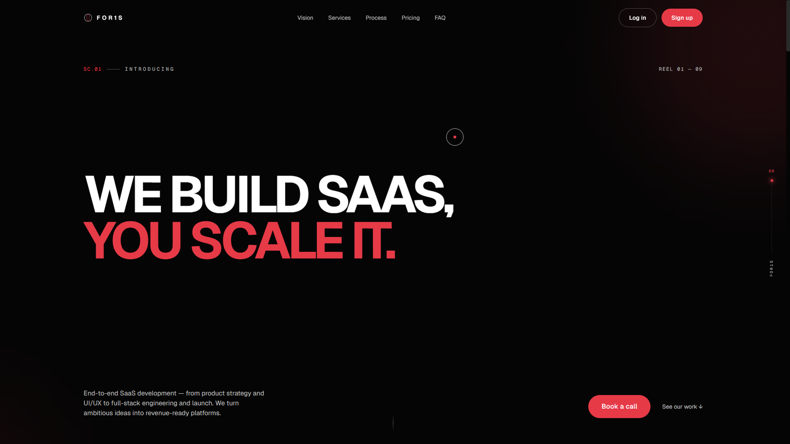

<div align="center">

# FOR1S

### A premium motion-first SaaS landing page built with Next.js, TypeScript, GSAP, and modern web technologies.

<p>
A frontend engineering project exploring how cinematic motion, thoughtful interaction design, and modern architecture can create memorable digital experiences without sacrificing performance or accessibility.
</p>


</div>

---

# Overview

FOR1S is a premium SaaS landing page created to explore modern frontend engineering through cinematic motion, immersive interactions, and clean visual storytelling.

Instead of treating animation as decoration, every interaction is designed to improve hierarchy, guide attention, and create a polished user experience while maintaining responsiveness, accessibility, and performance.

The project also serves as a playground for experimenting with scalable component architecture, reusable animation systems, and backend-ready infrastructure.

---

# Features

### Motion & Experience

- 🎬 Cinematic multi-section landing experience
- ⚡ Smooth scrolling powered by Lenis
- ✨ GSAP ScrollTrigger animations
- 🎭 SplitText reveal animations
- 🎯 Reusable motion primitives
- 🖱️ Custom cursor interactions
- 📱 Fully responsive layouts

### UI Components

- Premium navigation
- Interactive FAQ accordion
- Animated pricing section
- Testimonial carousel
- Product showcase
- Call-to-action sections
- Modular reusable React components

### Engineering

- Next.js App Router architecture
- TypeScript throughout
- Tailwind CSS utility-first styling
- Prisma ORM integration
- PostgreSQL support
- Zod validation
- API Routes ready for backend expansion

### Accessibility

- Reduced-motion support
- Keyboard-friendly navigation
- Semantic HTML structure
- Responsive layouts
- Performance-first animations

---

# Tech Stack

| Category | Technology |
|-----------|------------|
| Framework | Next.js 14 |
| Language | TypeScript |
| Styling | Tailwind CSS |
| Animation | GSAP, ScrollTrigger, SplitText, Framer Motion, Lenis |
| Backend | Next.js API Routes |
| Database | PostgreSQL |
| ORM | Prisma |
| Validation | Zod |

---

# Project Structure

```text
.
├── app/
├── components/
│   ├── layout/
│   ├── sections/
│   └── ui/
├── hooks/
├── lib/
├── prisma/
├── public/
├── package.json
├── tailwind.config.ts
├── next.config.mjs
└── README.md
```

---

# Getting Started

## Clone the repository

```bash
git clone https://github.com/subhamrout818/FOR1S.git

cd FOR1S
```

---

## Install dependencies

```bash
npm install
```

---

## Configure environment variables

Create a `.env` file.

```env
DATABASE_URL="your_postgresql_connection_string"
```

---

## Initialize Prisma

```bash
npx prisma migrate dev

npx prisma generate
```

---

## Start the development server

```bash
npm run dev
```

Visit

```
http://localhost:3000
```

---

# Design Philosophy

FOR1S follows a few core principles throughout the project.

- Motion should communicate, never distract.
- Typography should establish hierarchy.
- Every interaction should feel intentional.
- Accessibility should never be sacrificed for aesthetics.
- Performance always comes before visual complexity.

---

# Roadmap

- [ ] React Three Fiber integration
- [ ] Advanced 3D interactions
- [ ] Interactive product showcase
- [ ] Scroll-based storytelling
- [ ] Authentication
- [ ] Client dashboard
- [ ] CMS integration
- [ ] SEO optimization
- [ ] Performance optimization
- [ ] Mobile interaction improvements

---

# Preview
<p align="center">
  
</p>
<p align="center">
  
</p>\
<p align="center">
  
</p>
<p align="center">
  
</p>
<p align="center">
  
</p>
<p align="center">
  
</p>
<p align="center">
  
</p>
<p align="center">
  
</p>
<p align="center">
  
</p>


---

# Live Demo

Coming soon.

---

# Why I Built This

FOR1S was built as a personal engineering project to explore the intersection of frontend development, motion design, and user experience.

The goal wasn't simply to recreate another SaaS landing page—it was to understand how thoughtful animation, modern architecture, and reusable components can work together to create experiences that feel premium while remaining maintainable and performant.

---

# Contributing

Contributions, suggestions, and feedback are always welcome.

If you'd like to improve the project, feel free to fork the repository and open a pull request.

---

# License

This project is released under the MIT License.

---

<div align="center">

### Built with ❤️ by **Subham Rout**

**Full-Stack Developer • Motion Designer • Video Editor**

</div>
