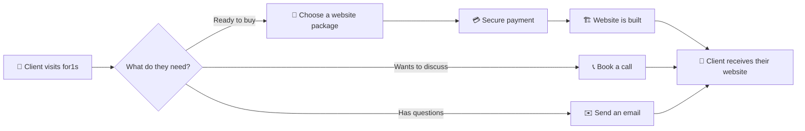

<div align="center">


<br/>

[](../../releases)
[](#)
[](#)


</div>


## ✨ What is `FOR1S`?

**FOR1S** is a premium, motion-first SaaS landing page — built to *sell websites*. It's the platform where clients **browse, book, and pay** for a website, or simply **book a call / send an email** to talk through their project first.

Under the hood it's a showcase of cinematic frontend engineering: fluid GSAP-driven animations, immersive 3D scenes powered by React Three Fiber and Three.js, all wrapped in a modern Next.js + TypeScript stack.

No back-and-forth over spreadsheets. No guessing on pricing. Just pick, pay, and launch — with an experience that feels like a product demo, not a form.

> **📌 Current status:** Development is currently paused — this repo is in **Public Preview**. Check the [Releases](../../releases) tab for the latest notes.

<div align="center">

```
   Browse   ─────▶   Book   ─────▶   Pay   ─────▶   Get Your Website 🚀
     🔍                📅               💳                  🌐
```

</div>

<br/>


## 🚀 Core Features

<table>
<tr>
<td width="50%" valign="top">

### 🛒 Book & Buy
Clients pick a website package that fits their needs and book it directly through the platform.

### 💳 Secure Payments
Integrated payment flow — pay for your website online, no manual invoicing required.

</td>
<td width="50%" valign="top">

### 📞 Book a Call
Not ready to commit? Clients can schedule a call to discuss requirements first.

### ✉️ Direct Contact
A built-in contact/mail flow to reach the for1s team for custom requests.

</td>
</tr>
</table>

<br/>

## 🖥️ Preview

<div align="center">

<!-- 📸 Add your homepage screenshot below -->


<br/><br/>

<!-- 📸 Add booking flow screenshot below -->


<br/><br/>

<!-- 📸 Add contact/call booking screenshot below -->


</div>

> 💡 Drop your screenshots inside a `/screenshots` folder in the repo root using the filenames above, and they'll render automatically here.

<br/>


## 🛠️ Tech Stack

<div align="center">


<!-- Add / adjust badges above to match anything past the "and T..." cut off in your repo description -->

</div>

<br/>

## ⚡ How It Works



<br/>

## 🧩 Getting Started

```bash
# Clone the repository
git clone https://github.com/subhamrout818/for1s.git

# Move into the project
cd for1s

# Install dependencies
npm install

# Run the development server
npm run dev
```

<br/>

## 📂 Project Structure

```
FOR1S/
├── app/ or src/       # Next.js app — pages, sections, animated scenes
├── components/        # UI components, 3D scenes, animated elements
├── public/            # Static assets
├── screenshots/        # 📸 Add your screenshots here
└── README.md
```

<sub>Update this to match your actual folder layout.</sub>

<br/>


## 🗺️ Roadmap

- [x] Cinematic landing page & animated hero
- [x] Immersive 3D scenes (React Three Fiber / Three.js)
- [x] Book-a-call & contact flow
- [ ] Website browsing & package selection
- [ ] Secure payment integration
- [ ] Client dashboard for order tracking
- [ ] Admin panel for managing bookings

> ⏸️ Development is currently **paused** — this reflects the public preview state, not the final roadmap.

<br/>

## 🤝 Contributing

Contributions, issues, and feature requests are welcome!
Feel free to check the [issues page](../../issues) or open a pull request.

```bash
# Fork it, then:
git checkout -b feature/your-feature
git commit -m "Add your feature"
git push origin feature/your-feature
```

<br/>

## 📬 Get in Touch

<div align="center">

[](#)
[](#)

</div>

<br/>

<div align="center">

### ⭐ If you like what for1s is building, drop a star — it helps a lot!


</div>
