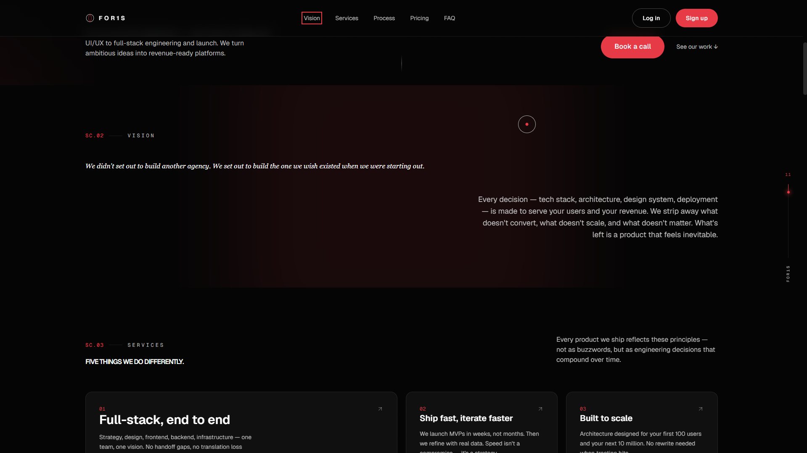
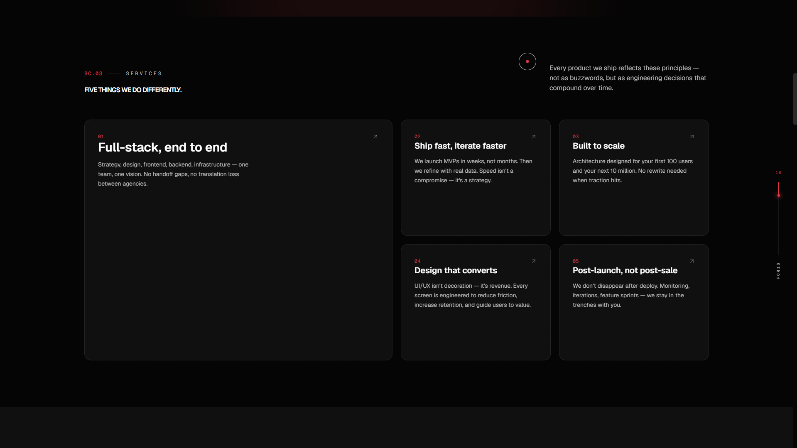
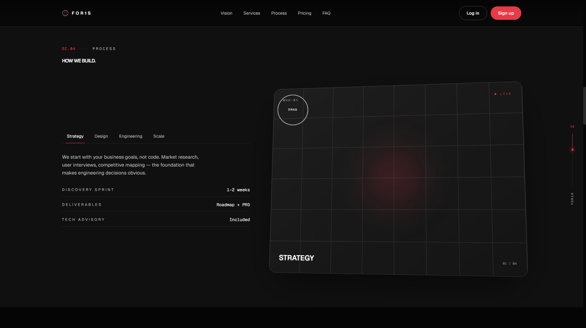
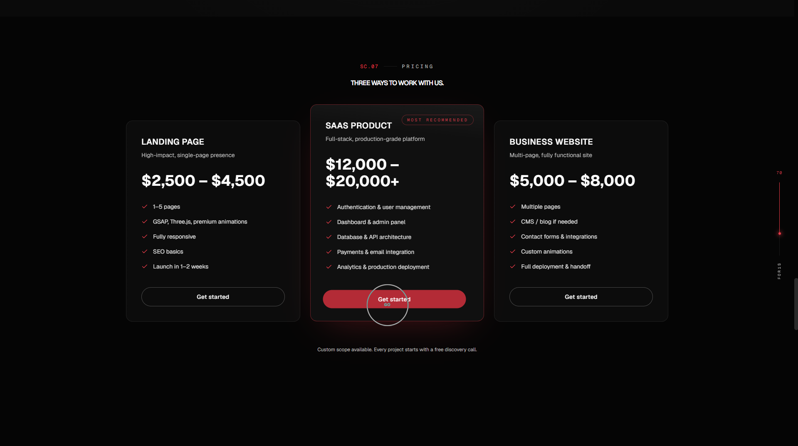
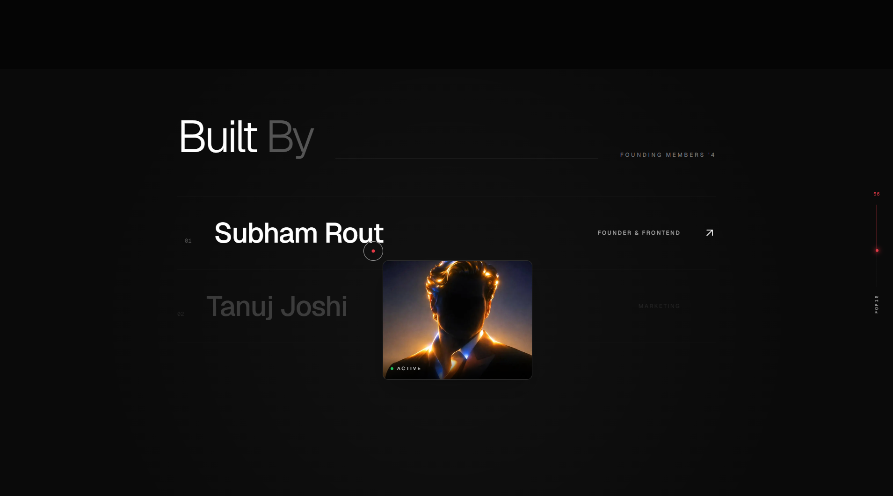
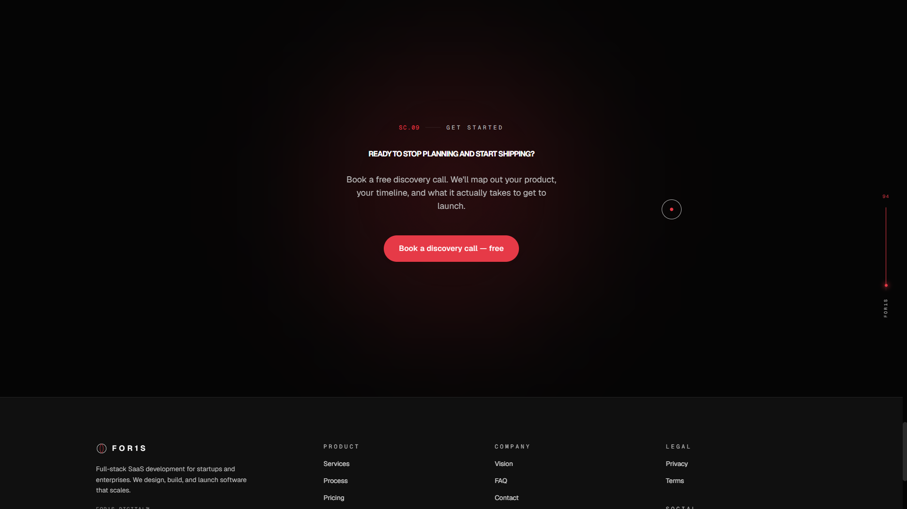
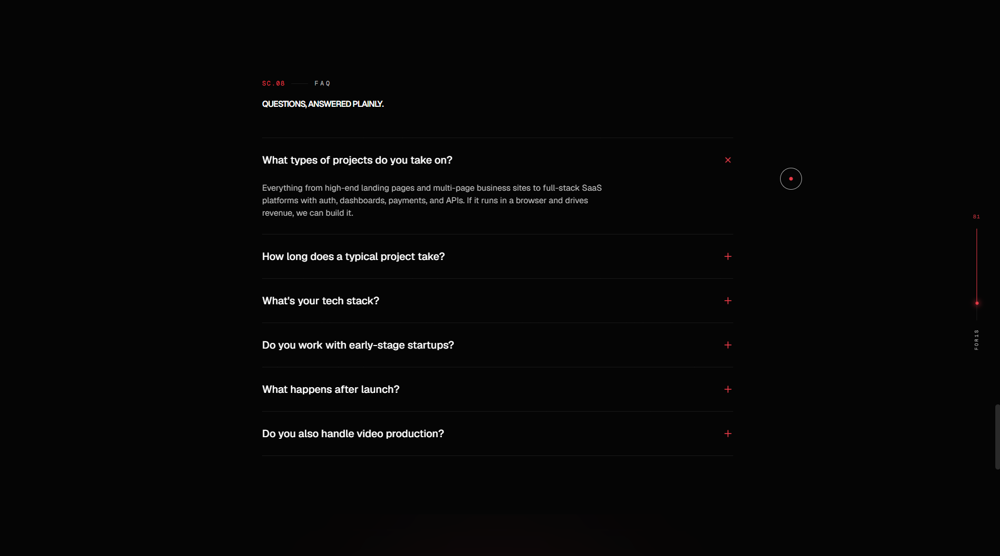
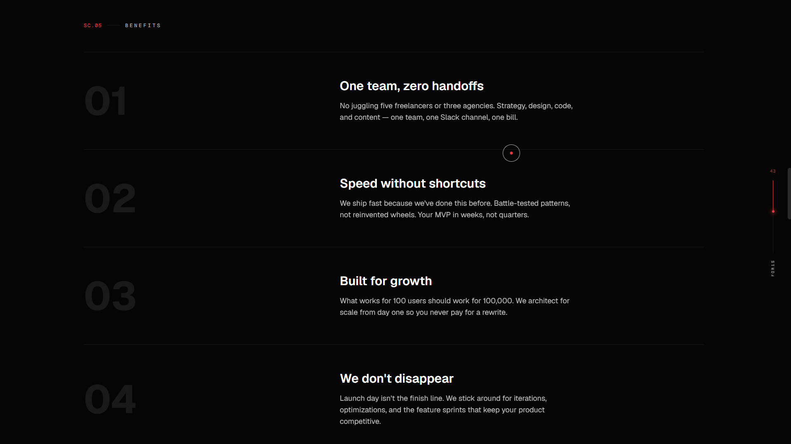

<p align="center">
  
</p>

<div align="center">

# FOR1S

### Premium websites and digital experiences for startups, businesses, creators, and modern brands.

<p>
FOR1S is a motion-first web studio focused on crafting premium digital experiences that combine cinematic design, modern engineering, and seamless user interactions. From business websites and SaaS platforms to personal portfolios and custom web applications, every project is built to be visually compelling, fast, accessible, and scalable.
</p>


</div>

---

# Overview

FOR1S is the foundation of a modern web studio dedicated to building premium websites for startups, local businesses, creators, agencies, and growing brands.

Rather than treating design as decoration, FOR1S focuses on creating meaningful digital experiences where every animation, interaction, and layout serves a purpose. The goal is to deliver websites that not only look premium but also communicate clearly, perform exceptionally, and convert visitors into customers.

Built on a scalable architecture using modern web technologies, FOR1S serves as both the agency website and the design system behind future client projects.

---

# Services

### Business Websites

Professional websites designed to establish trust, improve online presence, and help businesses attract more customers.

### SaaS Landing Pages

High-converting landing pages focused on product presentation, user engagement, and conversion optimization.

### Personal Portfolios

Modern portfolios for developers, designers, photographers, creators, and professionals looking to showcase their work.

### Custom Web Applications

Tailor-made frontend experiences built with scalable architecture and modern development practices.

---

# Features

## Motion & Experience

- 🎬 Cinematic scroll experiences
- ⚡ Smooth Lenis scrolling
- ✨ GSAP ScrollTrigger animations
- 🎭 SplitText text reveals
- 🎯 Reusable animation system
- 🖱️ Interactive cursor effects
- 📱 Fully responsive layouts
- 🎨 Premium UI transitions

## Interface

- Modern navigation
- Services showcase
- Vision section
- Interactive development process
- Animated pricing cards
- FAQ accordion
- Conversion-focused call-to-actions
- Modular reusable components

## Engineering

- Next.js App Router
- TypeScript
- Tailwind CSS
- Prisma ORM
- PostgreSQL support
- API-ready architecture
- Reusable React components
- Scalable project structure

## Performance & Accessibility

- Semantic HTML
- Keyboard-friendly navigation
- Reduced-motion support
- Responsive across all devices
- Performance-first animations
- Clean, maintainable architecture

---

# Tech Stack

| Category | Technology |
|-----------|------------|
| Framework | Next.js 14 |
| Language | TypeScript |
| Styling | Tailwind CSS |
| Animation | GSAP, ScrollTrigger, SplitText, Lenis |
| Backend | Next.js API Routes |
| Database | PostgreSQL |
| ORM | Prisma |
| Validation | Zod |

---

# Project Structure

```text
.
├── app/
├── components/
│   ├── layout/
│   ├── sections/
│   └── ui/
├── hooks/
├── lib/
├── prisma/
├── public/
├── assets/
├── package.json
├── tailwind.config.ts
├── next.config.mjs
└── README.md
```

---

# Getting Started

## Clone the repository

```bash
git clone https://github.com/subhamrout818/FOR1S.git

cd FOR1S
```

---

## Install dependencies

```bash
npm install
```

---

## Configure environment variables

Create a `.env` file.

```env
DATABASE_URL="your_postgresql_connection_string"
```

---

## Initialize Prisma

```bash
npx prisma migrate dev

npx prisma generate
```

---

## Start the development server

```bash
npm run dev
```

Visit:

```text
http://localhost:3000
```

---
# Design Philosophy

FOR1S is built around one simple idea:

> Great websites don't just look beautiful—they communicate clearly, feel intuitive, and inspire confidence.

Every project follows these principles:

- Motion should guide attention, never distract.
- Design should solve problems before adding aesthetics.
- Performance is a feature, not an afterthought.
- Components should be reusable and scalable.
- Accessibility should be built in from the beginning.
- Every interaction should feel intentional.
- Simplicity creates better user experiences.

---

# Roadmap

- [ ] Production deployment
- [ ] Contact form backend
- [ ] Client inquiry system
- [ ] Portfolio case studies
- [ ] Project showcase
- [ ] Blog & insights
- [ ] SEO optimization
- [ ] Performance optimization
- [ ] Analytics integration
- [ ] Multi-language support

---

# Preview

<table>

<tr>
<td colspan="2" align="center">

### Vision



</td>
</tr>

<tr>
<td width="50%">

### Services



</td>

<td width="50%">

### Process



</td>
</tr>

<tr>
<td>

### Pricing



</td>

<td>

### Team



</td>
</tr>

<tr>
<td>

### Get Started



</td>

<td>

### FAQ



</td>
</tr>

<tr>
<td colspan="2">

### Benefits



</td>
</tr>

</table>

---

# Live Demo

🚧 **Currently in development**

The production deployment will be available soon.

---

# Why FOR1S Exists

FOR1S was created with a simple mission:

To help businesses establish an online presence that feels as premium as the products and services they offer.

Too many websites are slow, outdated, difficult to navigate, or fail to leave a lasting impression. FOR1S focuses on solving that problem by combining modern design, meaningful motion, and scalable engineering into websites that are visually engaging, performant, and built with long-term maintainability in mind.

Whether it's a local business looking to attract more customers, a startup launching its first product, or a creator building a personal brand, every project is approached with the same attention to detail and commitment to quality.

This repository showcases the frontend architecture, reusable component system, animation library, and development standards that power FOR1S and will continue to evolve as new client projects are built.

---

# Future Vision

The long-term goal of FOR1S is to become a modern digital studio delivering exceptional websites and digital experiences for businesses around the world.

Future projects will expand beyond websites into interactive experiences, advanced frontend systems, custom dashboards, and full-stack web applications while maintaining the same focus on performance, usability, and thoughtful design.

---

# Contributing

Feedback, suggestions, and improvements are always welcome.

If you'd like to contribute, report a bug, or suggest a feature, feel free to open an issue or submit a pull request.

---

# License

This project is licensed under the MIT License.

---

<div align="center">

## Built with ❤️ by **Subham Rout**

**Founder of FOR1S**

Full-Stack Developer • Motion Designer • Creative Developer

*"Crafting digital experiences that people remember."*

</div>
