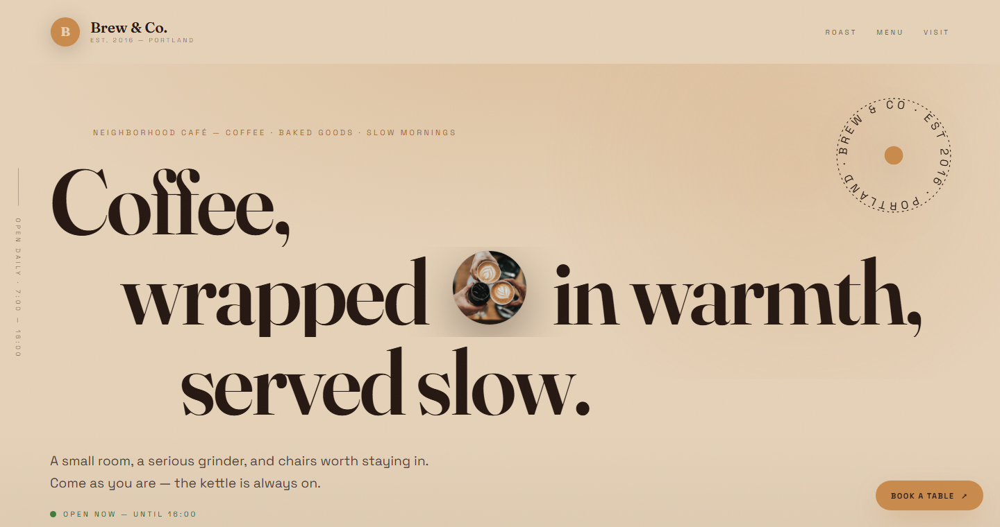
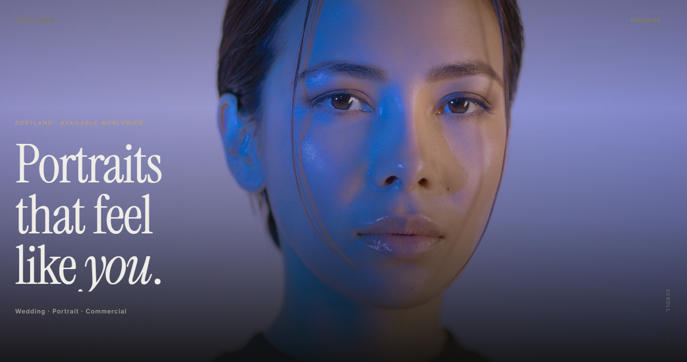
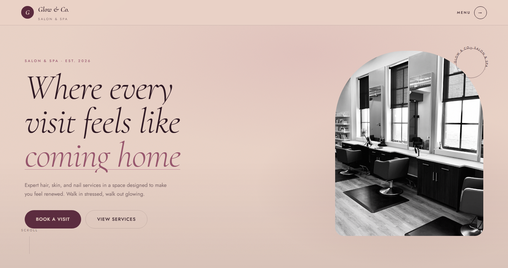

<div align="center">



<br>

**Custom, cinematic websites for businesses and brands.**
Design, development, motion, and launch — handled by one small team.

<br>

[](https://for1s.com)
[](https://cal.com/for1s/consultation)
[](mailto:hello@for1s.com)


</div>


## About

Most small and growing businesses have a real product and a forgettable website. The gap costs them trust before a visitor ever reads a word.

**FOR1S** closes that gap. We design and build custom websites from scratch — no templates, no borrowed layouts — so a business looks as serious online as it is in person. Design, copy, build, and launch come from the same team: one point of contact, one timeline, one price.

This repository is the studio's own platform: the public site at [for1s.com](https://for1s.com), plus the client portal and admin tools that run behind it.


## What we build

<table>
<tr>
<td width="33%" valign="top">

**`01` Custom design**
Every site is designed around one business, its customers, and one goal: turning a visitor into a customer.

</td>
<td width="33%" valign="top">

**`02` Full-stack development**
Clean, modern code on a platform that is fast, secure, and easy to update.

</td>
<td width="33%" valign="top">

**`03` Motion & interaction**
Scroll-driven reveals, magnetic controls, and cinematic transitions — used with restraint, never as decoration.

</td>
</tr>
<tr>
<td width="33%" valign="top">

**`04` Performance & SEO**
Pages built to load fast on patchy mobile connections, with SEO in place from day one.

</td>
<td width="33%" valign="top">

**`05` Responsive by default**
Mobile-first, tested on real phones, premium on every screen size.

</td>
<td width="33%" valign="top">

**`06` Care & maintenance**
Launch is not the finish line. Updates, fixes, and improvements keep the site working after go-live.

</td>
</tr>
</table>


## Selected work

Three fictional concept sites built as interactive demos. They demonstrate design direction and frontend implementation; they are not presented as completed client engagements.

<table>
<tr>
<td width="50%" valign="top">

<a href="https://for1s.com/demo/brew-and-co/index.html"></a>

### Brew & Co.
*Café & restaurant · 2026*

A café website concept exploring menu, opening hours, location, and a proposed mobile-friendly booking journey.

`Design` `Build` `Booking flow` `SEO`
[**View demo →**](https://for1s.com/demo/brew-and-co/index.html) · [Case study](https://for1s.com/work/brew-and-co)

</td>
<td width="50%" valign="top">

<a href="https://for1s.com/demo/studio-arun/index.html"></a>

### Studio Arun
*Photographer · 2026*

A fictional photographer portfolio concept with a cinematic gallery, work categories, and a proposed enquiry flow.

`Design` `Build` `Branding` `Gallery`
[**View demo →**](https://for1s.com/demo/studio-arun/index.html) · [Case study](https://for1s.com/work/studio-arun)

</td>
</tr>
<tr>
<td width="50%" valign="top">

<a href="https://for1s.com/demo/glow-and-co/index.html"></a>

### Glow & Co.
*Salon & spa · 2026*

A fictional salon concept exploring an editorial visual identity, service information, and a proposed booking journey.

`Design` `Build` `Online booking` `Brand`
[**View demo →**](https://for1s.com/demo/glow-and-co/index.html) · [Case study](https://for1s.com/work/glow-and-co)

</td>
<td width="50%" valign="top">

### Beyond the marketing site

The platform in this repo also ships:

- **Client portal** — projects, milestones, deliverables with versioned review and comments, files, billing, messages, and support tickets
- **Admin workspace** — clients, leads, projects, deliverables, payments, tickets, and team
- **Blog** and a **contact flow** with email notifications

</td>
</tr>
</table>


## Technology

<div align="center">


</div>

| Layer | Stack |
| :-- | :-- |
| **Framework** | Next.js (App Router), React, TypeScript |
| **Styling** | Tailwind CSS |
| **Motion** | GSAP, Framer Motion, Lenis smooth scroll |
| **Data** | PostgreSQL via Prisma |
| **Auth & security** | JWT sessions in HTTP-only cookies (`jose`), bcrypt, Google & GitHub OAuth, Zod validation, rate limiting |
| **Email** | Resend |


## Design philosophy

| | |
| :-- | :-- |
| **Hierarchy** | One idea per screen. The eye should know where to go before it reads. |
| **Typography** | Large, confident type carries the brand. Everything else gets out of the way. |
| **Motion** | Motion guides attention and adds weight to key moments. If it doesn't help, it's cut. |
| **Interaction** | Controls respond to the pointer and feel physical, without slowing anyone down. |
| **Performance** | Speed is part of the design. A premium site that loads slowly isn't premium. |
| **Responsiveness** | Built mobile-first, because that's where most customers arrive. |
| **Conversion** | Every page has a single job: move a visitor toward a booking, a call, or an enquiry. |
| **Brand perception** | The site should make the business look as serious as the work behind it. |


## How we work

```text
 DISCOVER  ───▶  DESIGN  ───▶  BUILD  ───▶  LAUNCH & CARE
```

| Stage | What happens |
| :-- | :-- |
| **Discover** | Kickoff call. We learn the business, its customers, and its competitors, then map exactly what the site needs to win — sitemap and copy plan. |
| **Design** | Wireframes first, then a clickable mockup tailored to the brand. Revisions until it's right. |
| **Build** | Mobile-first, SEO-ready, tested on real phones. |
| **Launch & care** | We handle domain, hosting, and going live — typically within 1–3 weeks — then stay on for updates and support through care plans. |


## Team

| | | |
| :-- | :-- | :-- |
| **Subham Rout** | Founder & Full-stack | [@subhamrout818](https://github.com/subhamrout818) |
| **Sidhi Samantaray** | Co-founder & Marketing | |
| **Tanuj Joshi** | Co-founder & IT | |


## Project status

| | |
| :-- | :-- |
| **Version** | `0.1.0` |
| **Deployment** | Live at [for1s.com](https://for1s.com) |
| **Source** | Public repository · © 2026 FOR1S Digital. All rights reserved. |

<details>
<summary><b>Run it locally</b></summary>

<br>

Requires Node.js and a PostgreSQL database.

```bash
git clone https://github.com/subhamrout818/for1s.git
cd for1s
npm install

cp .env.example .env        # set DATABASE_URL and JWT_SECRET (32+ chars)
npx prisma migrate dev
npm run db:seed             # demo data; prints generated demo passwords once
npm run dev
```

Email delivery (Resend) and Google / GitHub sign-in are optional; see `.env.example`.

Seeding refuses a non-local database unless `ALLOW_REMOTE_SEED=1`, and `npm run db:clear` (wipes all data) requires `CONFIRM_DB_HOST=<your database host>`. Set `SEED_ADMIN_PASSWORD` / `SEED_CLIENT_PASSWORD` to choose the demo passwords.

</details>

<details>
<summary><b>Repository layout</b></summary>

<br>

```text
app/          Routes: marketing site, blog, work, portal (dashboard), admin, API
components/   Sections, layout chrome, portal UI, motion primitives
lib/          Auth, data, email, rate limiting, content (work, members)
prisma/       Schema, migrations, seed
public/       Static assets and the three live demo sites
logos/        Brand marks — SVG and PNG
assets/       README artwork and section screenshots
```

</details>


## Start a project

<div align="center">

**Tell us about your business. We'll tell you exactly what it takes.**

<br>

[](https://cal.com/for1s/consultation)
[](mailto:hello@for1s.com)

<br>

[Website](https://for1s.com) · [X](https://x.com/for1s) · [YouTube](https://youtube.com/@for1s) · [Instagram](https://instagram.com/for1s.social)

</div>

<br>


